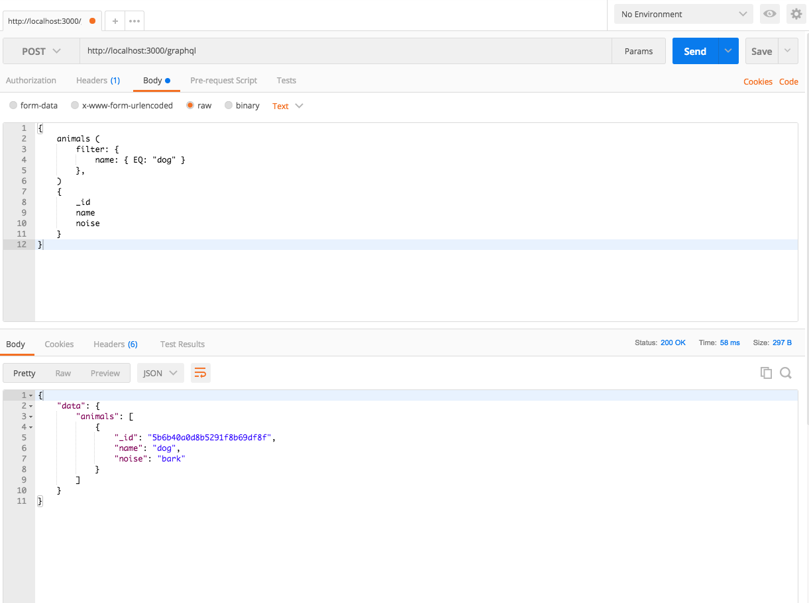

## GraphQL MongoDB TypeScript Example 1

This example demonstrates use of:
* TypeScript
* Native mongodb client
* `graphql-to-mongodb` to allow use of most of the mongo db query operators via GraphQL HTTP

Assumes the existence of a local mongo database called `poc_test`, with a collection `animals` that has data structured as follows:

```javascript
/* 1 */
{
    "_id" : ObjectId("5b6b40a0d8b5291f8b69df8f"),
    "name" : "dog",
    "noise" : "bark"
}

/* 2 */
{
    "_id" : ObjectId("5b6b40bbd8b5291f8b69df9b"),
    "name" : "cat",
    "noise" : "meow"
}

/* 3 */
{
    "_id" : ObjectId("5b6b698ed8b5291f8b69e533"),
    "name" : "sea lion",
    "noise" : "bark"
}
```

To build and run using the yarn package manager (`brew install yarn` if you don't have it):

```
yarn install
yarn build
yarn start
```



